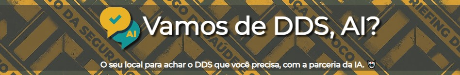

#  Vamos de DDS, AI? 🤖💬

> **Encontre o DDS perfeito para sua equipe com a ajuda da IA!** 

## ✨ Sobre o Projeto

Com um banho de conhecimento e inspiração obito durante a semana de Imersão Dev Gemini, produzido pela parceria [Alura](https://www.alura.com.br/imersao) e Google, nasce o "Vamos de DDS, AI?". Uma ferramenta online para facilitar a vida de técnicos e da gestão na hora de realizar o **Diálogo Diário de Segurança (DDS)**.

Com uma interface intuitiva e a com apoio da inteligência artificial, você pode encontrar por temas específicos ou se deixar surpreender com sugestões de DDS relevantes e prontos para usar!

## 🚀 Funcionalidades Principais

- **Pesquisa Inteligente:** Encontre rapidamente o DDS ideal buscando por palavras-chave relacionadas ao tema, objetivo ou conteúdo.
- **Sugestões Surpreendentes:** Explore nossa seleção de DDS e encontre novas ideias, através do botão "Surpreenda-me.
- **Interface Amigável:** Design responsivo e fácil de usar, tanto em desktops quanto em dispositivos móveis.
- **Inspiração e promoção da cultura de segurança:** Uma maneira interativa e envolvente de abordar temas de segurança no trabalho e se inspirar com as frases na página inicial.

## 💻 Tecnologias Utilizadas

- HTML
- CSS
- JavaScript
- Gemini (não tem como não citar aqui 🤖💖)

 ## 🧰 Como Usar

1. **Acesse o site:**  [vamos-de-dds-ai.vercel.app](vamos-de-dds-ai.vercel.app) (projeto hospedado para visualização e teste na plataforma Vercel)
2. **Inspire-se:** Uma nova frase inspiradora e apresentada sempre que a página é carregada. Aproveite.
3. **Digite seu tema:** No campo de busca, em poucas palabras, insira o tema que você deseja abordar no DDS.
4. **Explore os resultados:** Nosso sistema de busca otimizado irá verificar nossa base de dados, e trará uma lista de resultados de DDS, em ordem de relevância para você.
5. **Supreenda-se:** Ainda não pensou em um tema, não tem problema. Vamos te sugerir 2 ótimos DDS através do botão "Surpreenda-me".
6. **Clique para visualizar:** Acho o que procurar? Agora é visualizar o DDS completo, com todas as informações que você precisa. Podendo salvar em PDF ou imprimir (mas só se realmente for necessário, pense verde 🌱).
7. **Agora é só se preparar e caprichar na aplicação no DDS!**

## 🤝  Contribuindo

Adoraríamos receber sua contribuição para tornar o "Vamos de DDS, AI?" ainda melhor! Você pode:

- **Reportar Bugs:** Encontrou algum problema? Abra uma _issue_ no GitHub detalhando o erro.
- **Sugerir Melhorias:** Tem ideias para novas funcionalidades ou melhorias no código? Envie um _pull request_!

## 📧 Contato

Criado com 💚 por [Elias Michel Salce](https://github.com/elias-salce)

[esalce@outlook.com](esalce@outlook.com)

## 🧑 Sobre mim

Olá, me chamo Elias. Trabalho na área de Saúde e Segurança do Trabalho a mais de 10 anos, atualmente como Analista senior. Sou bombeiro civil, formado em Técnico de Segurança do Trabalho, Gestão Ambiental e com uma pós em Business Intelligence & Analytics. Amo a área que trabalho, mas sou um super entusiasta da tecnologia, o que tem me ajudado a resolver várias questão em minha área de atuação. 
Atualmente tenho me aventurado bastante em IA e Python, mas essa [Imersão da Alura](https://www.alura.com.br/imersao), Dev com Gemini, me fez voltar à minha adolescência no curso de WebDesign e expandir para um infinito de possibilidades.
E olha eu aqui postando meu primeiro projeto no GITHUB. 💖 

*Lembrando:*

- Todos os DDS foram criados com a ajuda da IA, mas revisados e ajustados por um humano 🤖🤝🧑.

Juntos, podemos tornar o ambiente de trabalho cada dia mais seguro! 💪
